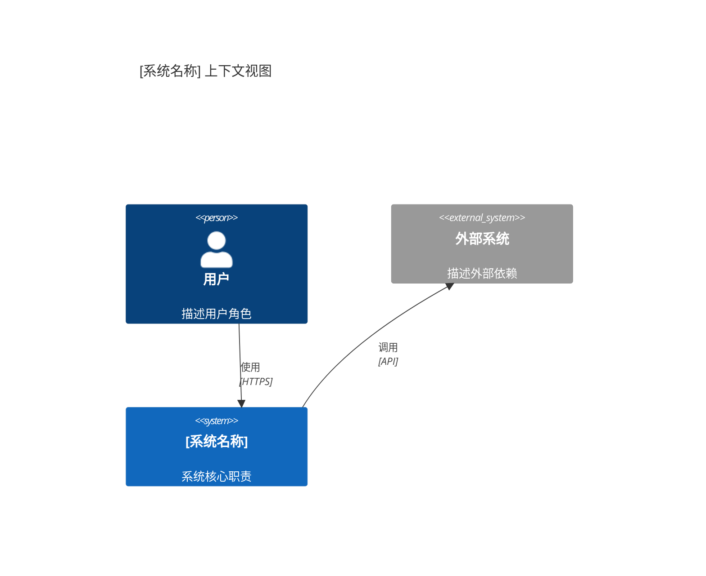
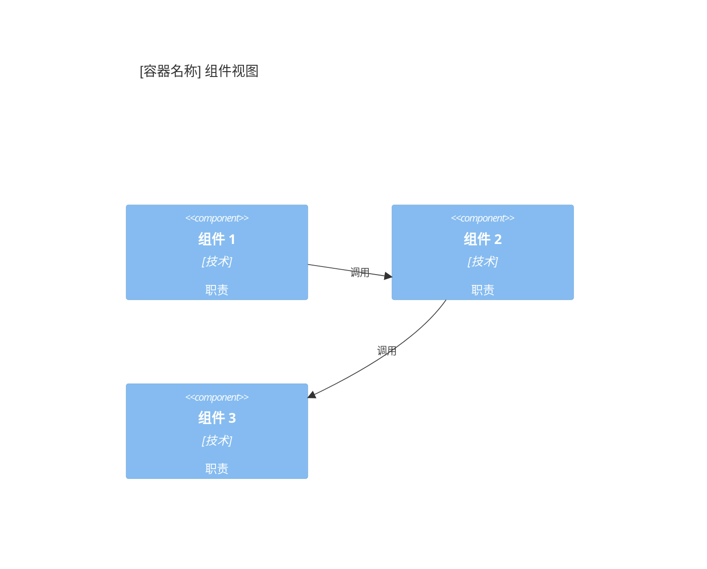
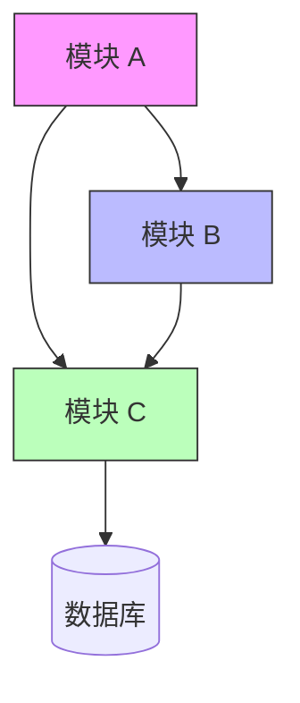
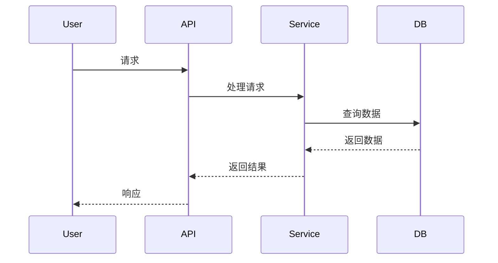

# [系统名称] 架构文档

---

## 1. 系统概述

### 1.1 愿景与目标

[用一句话说明系统为什么存在，解决什么业务问题]

**业务目标**：
- [目标 1]
- [目标 2]

**成功标准**：
- [可衡量的成功指标 1]
- [可衡量的成功指标 2]

---

### 1.2 设计原则

[3-5 条可操作的设计原则，指导架构决策]

1. **[原则名称]** — [简要说明]
   - 示例：简单优于复杂 — 优先选择简单的解决方案，除非有明确的理由需要复杂设计

2. **[原则名称]** — [简要说明]

3. **[原则名称]** — [简要说明]

---

### 1.3 术语表

| 术语 | 定义 |
|------|------|
| [术语 1] | [定义] |
| [术语 2] | [定义] |
| [术语 3] | [定义] |

---

## 2. 架构决策记录 (ADR)

### ADR-001: [决策标题]

- **状态**：已批准 / 讨论中 / 已废弃
- **日期**：YYYY-MM-DD
- **背景**：[为什么需要这个决策，面临什么问题]
- **决策**：[选择了什么方案]
- **理由**：[为什么选择这个方案，考虑了哪些因素]
- **后果**：[这个决策带来的影响，包括正面和负面]

---

### ADR-002: [决策标题]

- **状态**：已批准 / 讨论中 / 已废弃
- **日期**：YYYY-MM-DD
- **背景**：[为什么需要这个决策]
- **决策**：[选择了什么方案]
- **理由**：[为什么选择这个方案]
- **后果**：[这个决策带来的影响]

---

## 3. 系统视图 (C4 模型)

### 3.1 上下文视图 (C4 Level 1)

[系统与外部系统/用户的关系]



---

### 3.2 容器视图 (C4 Level 2)

[系统内部的技术组件划分]


---

### 3.3 组件视图 (C4 Level 3)

[关键容器的内部组件划分]



---

## 4. 架构关键技术

### 4.1 技术选型

| 技术类别 | 选型 | 理由 |
|----------|------|------|
| 编程语言 | [语言] | [选型理由] |
| 框架 | [框架] | [选型理由] |
| 数据库 | [数据库] | [选型理由] |
| 消息队列 | [MQ] | [选型理由] |
| 缓存 | [缓存] | [选型理由] |

---

### 4.2 关键技术决策

**决策 1：[决策标题]**

- **背景**：[面临的问题]
- **选项**：[考虑的备选方案]
- **决策**：[最终选择]
- **影响**：[对架构的影响]

---

### 4.3 技术约束

**必须遵守的约束**：
- [约束 1] — [原因]
- [约束 2] — [原因]

**性能要求**（如适用）：
- [指标 1]：[目标值]
- [指标 2]：[目标值]

---

## 5. 关键架构内容

### 5.1 核心模块设计

**模块 1：[模块名称]**

- **职责**：[模块的核心职责]
- **关键接口**：[对外的主要接口]
- **依赖**：[依赖的其他模块]

---

**模块 2：[模块名称]**

- **职责**：[模块的核心职责]
- **关键接口**：[对外的主要接口]
- **依赖**：[依赖的其他模块]

---

### 5.2 模块间依赖关系

[模块间的依赖方向和调用约定]



**依赖规则**：
- [规则 1] — 如"上层模块可以调用下层模块，反之不行"
- [规则 2] — 如"模块间通过接口通信，不直接依赖实现"

---

### 5.3 数据流设计

[核心业务场景的数据流]

**场景 1：[场景名称]**



---

**场景 2：[场景名称]**

[同上，描述另一个核心场景]

---

## 6. 接口规范（指导性）

### 6.1 接口设计原则

**RESTful 约定**：
- 使用标准 HTTP 方法（GET/POST/PUT/DELETE）
- 资源使用名词复数形式（`/users`, `/orders`）
- 使用 HTTP 状态码表达结果

**错误处理规范**：
```json
{
  "error": {
    "code": "ERROR_CODE",
    "message": "人类可读的错误描述",
    "details": {}
  }
}
```

---

### 6.2 内部服务边界

**模块间接口约定**：
- [约定 1] — 如"模块间通过接口定义通信"
- [约定 2] — 如"禁止跨模块直接访问数据库"

**数据格式约定**：
- [约定 1] — 如"统一使用 JSON 格式"
- [约定 2] — 如"时间使用 ISO-8601 格式"

---

### 6.3 接口变更管理

**变更流程**：
1. 提出变更请求（说明原因和影响）
2. 评估兼容性（是否破坏现有接口）
3. 确定版本策略（向后兼容/破坏性变更）
4. 通知相关方（文档更新 + 通知）

**版本管理策略**：
- 向后兼容变更：小版本号递增（1.1 → 1.2）
- 破坏性变更：主版本号递增（1.x → 2.0）
- 废弃接口：至少保留一个版本周期

---

## 变更记录

| 日期 | 变更内容 | 关联提交 |
|------|----------|----------|
| YYYY-MM-DD | 初始版本 | [commit-hash] |
| YYYY-MM-DD | [变更描述] | [commit-hash] |

---

## 使用说明

**本文档适用于**：
- 软件架构师 — 架构决策参考
- 开发工程师 — 理解系统结构和模块职责
- 新成员 — 快速了解系统架构

**文档维护**：
- 责任人：[架构负责人]
- 审查周期：随代码变更更新
- 存储位置：`docs/architecture/YYYY-MM-DD-<system-name>.md`

**相关文档**：
- [ADR 索引](decisions/README.md)
- [项目 CLAUDE.md](../../CLAUDE.md)
