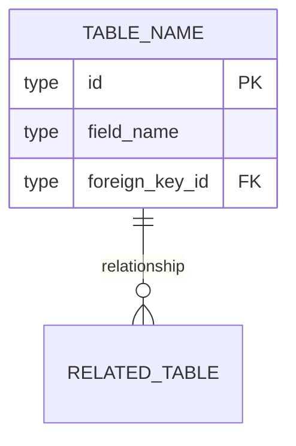
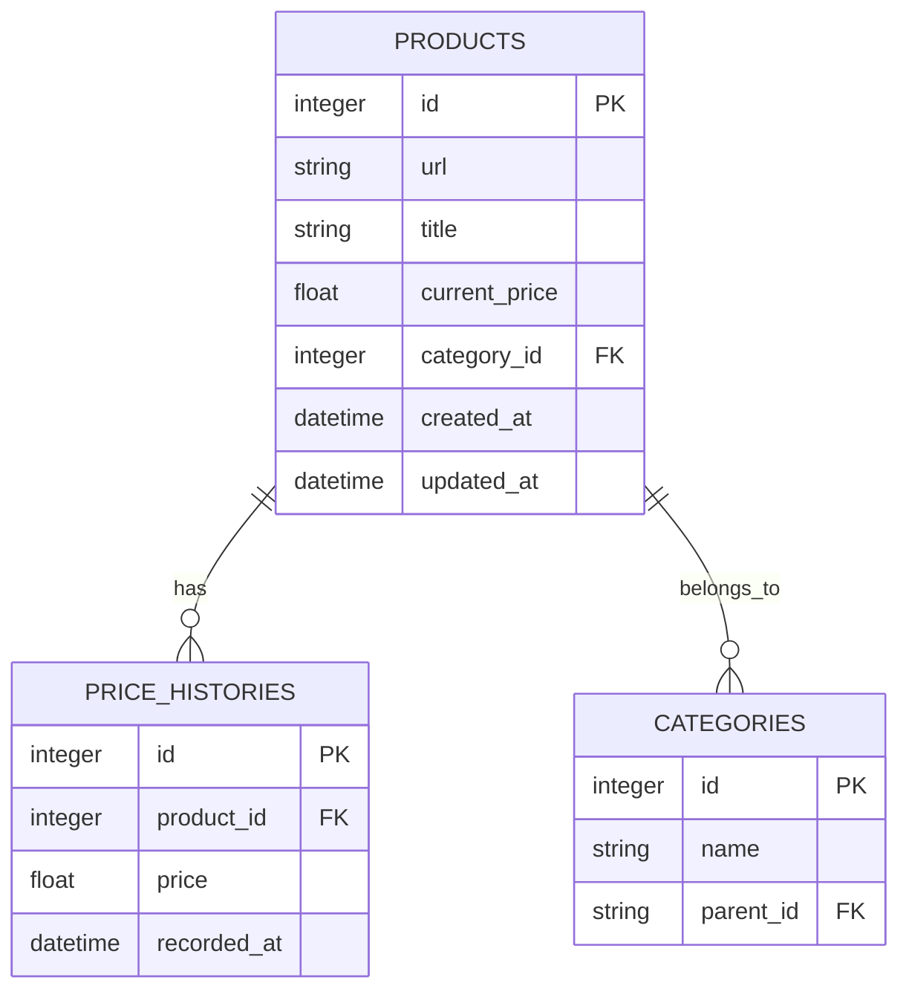

# 数据库设计文档模板

**用途**：用于 `/zcf:arch-doc "阶段 X：XXX 模块数据库设计"` 生成的标准格式

**保存位置**：`docs/architecture/phases/phase-X/<module-name>/database-schema.md`

---

## 模板结构

```markdown
# {{MODULE_NAME}} 数据库设计

**创建日期**：{{DATE}}
**最后更新**：{{LAST_UPDATE}}
**版本**：{{VERSION}}

**所属阶段**：{{PHASE_NAME}}
**所属模块**：{{MODULE_NAME}}

**数据库类型**：{{DB_TYPE}}（PostgreSQL / MySQL / SQLite / MongoDB）

---

## 1. 概述

### 1.1 设计原则

{{数据库设计遵循的原则}}

1. **范式优先** — 遵循第三范式（3NF），避免数据冗余
2. **索引优化** — 为频繁查询的字段创建索引
3. **扩展性** — 预留扩展字段，支持未来需求
4. **审计追踪** — 所有表包含 `created_at` 和 `updated_at`

### 1.2 命名规范

**表名**：
- 使用复数名词（`users`, `products`）
- 小写字母，下划线分隔（`order_items`）

**字段名**：
- 使用单数名词（`id`, `name`, `price`）
- 小写字母，下划线分隔（`created_at`）
- 主键统一使用 `id`
- 外键使用 `{{referenced_table_singular}}_id` 格式

---

## 2. ER 图



---

## 3. 表结构

{{#each TABLES}}
### {{TABLE_NAME}}

**描述**：{{TABLE_DESCRIPTION}}

**字段**：
| 字段名 | 类型 | 约束 | 默认值 | 说明 |
|--------|------|------|--------|------|
{{#each FIELDS}}
| {{this.name}} | {{this.type}} | {{this.constraints}} | {{this.default}} | {{this.description}} |
{{/each}}

**索引**：
| 索引名 | 字段 | 类型 | 说明 |
|--------|------|------|------|
{{#each INDEXES}}
| {{this.name}} | {{this.fields}} | {{this.type}} | {{this.description}} |
{{/each}}

**外键**：
| 外键名 | 引用表 | 引用字段 | 级联规则 |
|--------|--------|----------|----------|
{{#each FOREIGN_KEYS}}
| {{this.name}} | {{this.reference_table}} | {{this.reference_field}} | {{this.on_delete}} |
{{/each}}

**DDL**：
```sql
CREATE TABLE {{TABLE_NAME}} (
    id INTEGER PRIMARY KEY AUTOINCREMENT,
    field_name TYPE NOT NULL,
    foreign_key_id INTEGER,
    created_at TIMESTAMP DEFAULT CURRENT_TIMESTAMP,
    updated_at TIMESTAMP DEFAULT CURRENT_TIMESTAMP,
    
    FOREIGN KEY (foreign_key_id) REFERENCES other_table(id) ON DELETE CASCADE,
    
    INDEX idx_field_name (field_name)
);
```

**使用示例**：
```sql
-- 插入
INSERT INTO {{TABLE_NAME}} (field_name, foreign_key_id)
VALUES ('value', 1);

-- 查询
SELECT * FROM {{TABLE_NAME}} WHERE field_name = 'value';

-- 更新
UPDATE {{TABLE_NAME}} SET field_name = 'new_value' WHERE id = 1;

-- 删除
DELETE FROM {{TABLE_NAME}} WHERE id = 1;
```

---

{{/each}}

## 4. 数据迁移

### 4.1 初始迁移

```sql
-- 迁移文件：migrations/001_initial.sql
-- 执行日期：{{DATE}}

{{INITIAL_MIGRATION_SQL}}
```

### 4.2 历史迁移

| 迁移文件 | 执行日期 | 变更内容 |
|----------|----------|----------|
| 001_initial.sql | {{DATE}} | 创建初始表结构 |
| 002_add_index.sql | {{DATE}} | 添加索引 |

---

## 5. 查询优化

### 5.1 常用查询

**查询 1：{{QUERY_DESCRIPTION}}**
```sql
{{QUERY_SQL}}
```
**执行计划**：
```
EXPLAIN ANALYZE {{QUERY_SQL}}
```

### 5.2 性能考虑

- **索引使用**：{{INDEX_USAGE}}
- **避免全表扫描**：{{AVOID_FULL_TABLE_SCAN}}
- **分页策略**：{{PAGINATION_STRATEGY}}

---

## 6. 数据字典

| 表名 | 描述 | 记录数（预计） | 增长速率 |
|------|------|----------------|----------|
{{#each TABLES}}
| {{this.name}} | {{this.description}} | {{this.estimated_rows}} | {{this.growth_rate}} |
{{/each}}

---

## 7. 备份策略

**备份频率**：{{BACKUP_FREQUENCY}}

**备份方式**：
```bash
{{BACKUP_COMMAND}}
```

**恢复流程**：
```bash
{{RESTORE_COMMAND}}
```

---

## 8. 变更历史

| 日期 | 版本 | 变更内容 |
|------|------|----------|
| {{DATE}} | v1.0 | 初始版本 |
| {{DATE}} | v1.1 | {{CHANGE}} |

---

## 相关文档

- [模块详细设计](./detailed-design.md)
- [API 接口规范](./api-spec.md)
- [总体架构文档](../../YYYY-MM-DD-{{project-name}}.md)
```

---

## 使用示例

### 示例：存储模块数据库设计

```markdown
# 存储模块 数据库设计

**创建日期**：2026-03-26
**最后更新**：2026-03-26
**版本**：v1.0

**所属阶段**：Phase 1: MVP
**所属模块**：存储模块

**数据库类型**：SQLite（MVP 阶段），Phase 2 迁移到 PostgreSQL

---

## 1. 概述

### 1.1 设计原则

1. **范式优先** — 遵循第三范式（3NF）
2. **索引优化** — 为 URL、时间戳创建索引
3. **扩展性** — 预留 `metadata` JSON 字段
4. **审计追踪** — 所有表包含 `created_at` 和 `updated_at`

### 1.2 命名规范

- 表名：复数名词，下划线分隔（`products`, `price_histories`）
- 字段名：单数名词，下划线分隔（`product_id`, `created_at`）
- 主键：统一使用 `id`
- 外键：`{{table_singular}}_id` 格式

---

## 2. ER 图



---

## 3. 表结构

### products

**描述**：存储抓取的商品信息

**字段**：
| 字段名 | 类型 | 约束 | 默认值 | 说明 |
|--------|------|------|--------|------|
| id | INTEGER | PRIMARY KEY | - | 主键 |
| url | TEXT | NOT NULL, UNIQUE | - | 商品 URL |
| title | TEXT | NOT NULL | - | 商品标题 |
| current_price | REAL | - | NULL | 当前价格 |
| category_id | INTEGER | FOREIGN KEY | NULL | 分类 ID |
| metadata | JSON | - | NULL | 扩展元数据 |
| created_at | TIMESTAMP | - | CURRENT_TIMESTAMP | 创建时间 |
| updated_at | TIMESTAMP | - | CURRENT_TIMESTAMP | 更新时间 |

**索引**：
| 索引名 | 字段 | 类型 | 说明 |
|--------|------|------|------|
| idx_products_url | url | UNIQUE | URL 去重 |
| idx_products_category | category_id | NORMAL | 分类查询 |
| idx_products_created | created_at | NORMAL | 时间排序 |

**外键**：
| 外键名 | 引用表 | 引用字段 | 级联规则 |
|--------|--------|----------|----------|
| fk_category | categories | id | SET NULL |

**DDL**：
```sql
CREATE TABLE products (
    id INTEGER PRIMARY KEY AUTOINCREMENT,
    url TEXT NOT NULL UNIQUE,
    title TEXT NOT NULL,
    current_price REAL,
    category_id INTEGER,
    metadata JSON,
    created_at TIMESTAMP DEFAULT CURRENT_TIMESTAMP,
    updated_at TIMESTAMP DEFAULT CURRENT_TIMESTAMP,
    
    FOREIGN KEY (category_id) REFERENCES categories(id) ON DELETE SET NULL
);

CREATE INDEX idx_products_url ON products(url);
CREATE INDEX idx_products_category ON products(category_id);
CREATE INDEX idx_products_created ON products(created_at);
```

---

### price_histories

**描述**：存储商品价格历史

**字段**：
| 字段名 | 类型 | 约束 | 默认值 | 说明 |
|--------|------|------|--------|------|
| id | INTEGER | PRIMARY KEY | - | 主键 |
| product_id | INTEGER | NOT NULL, FOREIGN KEY | - | 商品 ID |
| price | REAL | NOT NULL | - | 价格 |
| recorded_at | TIMESTAMP | - | CURRENT_TIMESTAMP | 记录时间 |

**索引**：
| 索引名 | 字段 | 类型 | 说明 |
|--------|------|------|------|
| idx_price_product | product_id | NORMAL | 商品查询 |
| idx_price_recorded | recorded_at | NORMAL | 时间排序 |

**DDL**：
```sql
CREATE TABLE price_histories (
    id INTEGER PRIMARY KEY AUTOINCREMENT,
    product_id INTEGER NOT NULL,
    price REAL NOT NULL,
    recorded_at TIMESTAMP DEFAULT CURRENT_TIMESTAMP,
    
    FOREIGN KEY (product_id) REFERENCES products(id) ON DELETE CASCADE
);

CREATE INDEX idx_price_product ON price_histories(product_id);
CREATE INDEX idx_price_recorded ON price_histories(recorded_at);
```

---

### categories

**描述**：存储商品分类

**字段**：
| 字段名 | 类型 | 约束 | 默认值 | 说明 |
|--------|------|------|--------|------|
| id | INTEGER | PRIMARY KEY | - | 主键 |
| name | TEXT | NOT NULL | - | 分类名称 |
| parent_id | INTEGER | FOREIGN KEY | NULL | 父分类 ID |

**DDL**：
```sql
CREATE TABLE categories (
    id INTEGER PRIMARY KEY AUTOINCREMENT,
    name TEXT NOT NULL,
    parent_id INTEGER,
    
    FOREIGN KEY (parent_id) REFERENCES categories(id) ON DELETE SET NULL
);
```

---

## 4. 数据迁移

### 4.1 初始迁移

```sql
-- migrations/001_initial.sql
-- 2026-03-26

CREATE TABLE products (
    id INTEGER PRIMARY KEY AUTOINCREMENT,
    url TEXT NOT NULL UNIQUE,
    title TEXT NOT NULL,
    current_price REAL,
    category_id INTEGER,
    metadata JSON,
    created_at TIMESTAMP DEFAULT CURRENT_TIMESTAMP,
    updated_at TIMESTAMP DEFAULT CURRENT_TIMESTAMP,
    
    FOREIGN KEY (category_id) REFERENCES categories(id) ON DELETE SET NULL
);

CREATE TABLE price_histories (
    id INTEGER PRIMARY KEY AUTOINCREMENT,
    product_id INTEGER NOT NULL,
    price REAL NOT NULL,
    recorded_at TIMESTAMP DEFAULT CURRENT_TIMESTAMP,
    
    FOREIGN KEY (product_id) REFERENCES products(id) ON DELETE CASCADE
);

CREATE TABLE categories (
    id INTEGER PRIMARY KEY AUTOINCREMENT,
    name TEXT NOT NULL,
    parent_id INTEGER,
    
    FOREIGN KEY (parent_id) REFERENCES categories(id) ON DELETE SET NULL
);
```

---

## 5. 查询优化

### 5.1 常用查询

**查询 1：获取商品价格历史**
```sql
SELECT p.title, ph.price, ph.recorded_at
FROM products p
JOIN price_histories ph ON p.id = ph.product_id
WHERE p.url = 'https://example.com/product/123'
ORDER BY ph.recorded_at DESC
LIMIT 30;
```

**执行计划**：
```
EXPLAIN QUERY PLAN SELECT ...
-- 0|0|0|SEARCH TABLE products USING INDEX idx_products_url (url=?)
-- 0|0|0|SEARCH TABLE price_histories USING INDEX idx_price_product (product_id=?)
```

---

## 7. 备份策略

**备份频率**：每日

**备份方式**：
```bash
# SQLite 备份
sqlite3 data.db ".backup 'backup/data_$(date +%Y%m%d).db'"
```

**恢复流程**：
```bash
cp backup/data_20260326.db data.db
```

---

## 相关文档

- [模块详细设计](./detailed-design.md)
- [API 接口规范](./api-spec.md)
- [总体架构文档](../../2026-03-26-ecommerce-analysis-system.md)
```

---

## 最佳实践

1. **ER 图先行** — 先画 ER 图，再创建表
2. **索引策略** — 为查询条件、排序字段创建索引
3. **外键约束** — 使用外键保证数据一致性
4. **迁移脚本** — 所有 Schema 变更通过迁移脚本管理
5. **审计字段** — 所有表包含 `created_at` 和 `updated_at`
