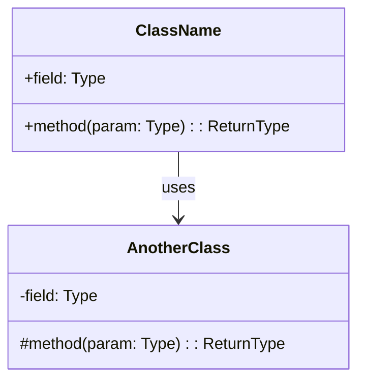
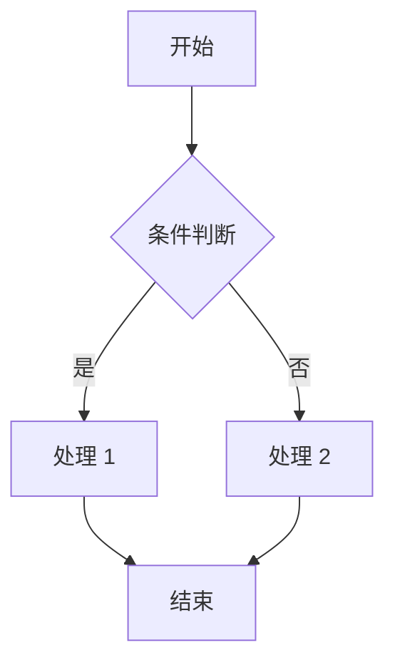
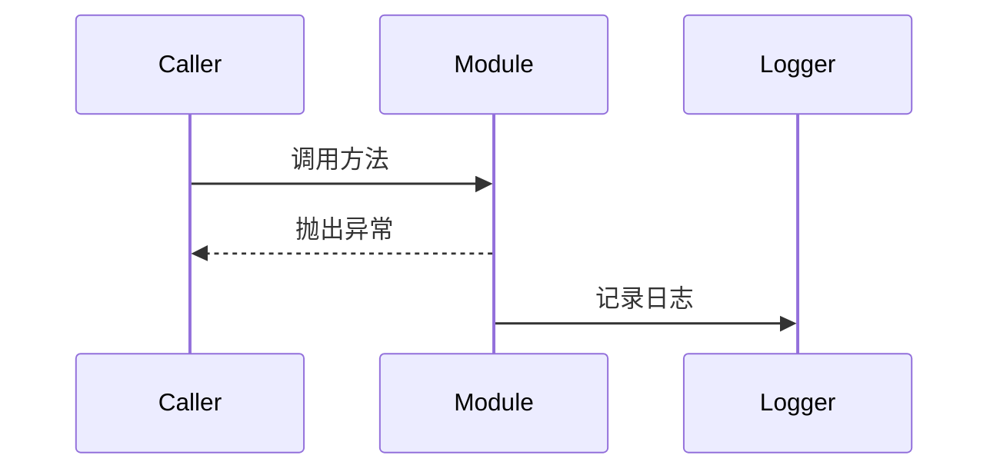
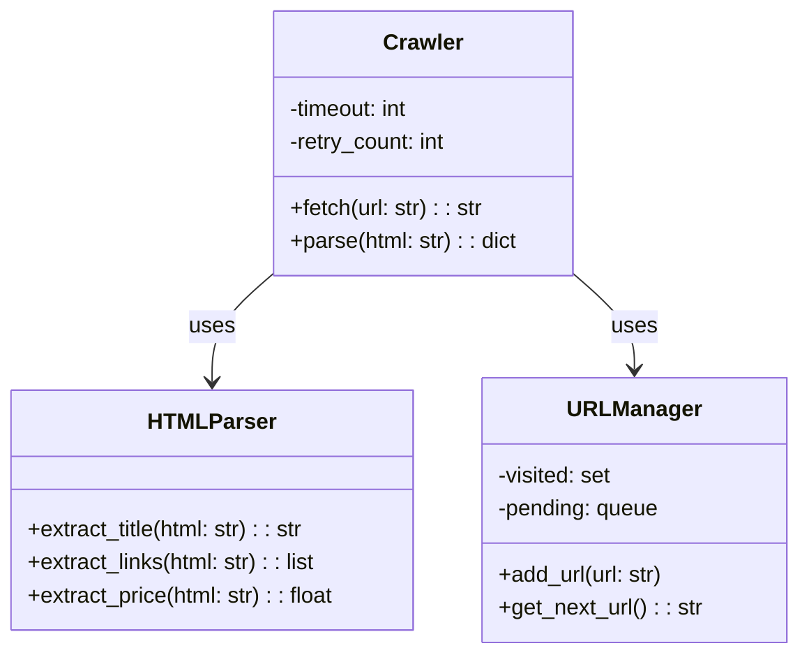
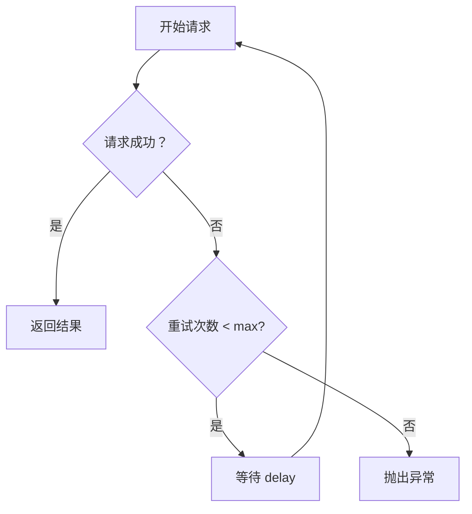

# 模块详细设计文档模板

**用途**：用于 `/zcf:arch-doc "阶段 X：XXX 模块详细设计"` 生成的标准格式

**保存位置**：`docs/architecture/phases/phase-X/<module-name>/detailed-design.md`

---

## 模板结构

```markdown
# {{MODULE_NAME}} 详细设计

**创建日期**：{{DATE}}
**最后更新**：{{LAST_UPDATE}}
**版本**：{{VERSION}}

**所属阶段**：{{PHASE_NAME}}
**所属项目**：{{PROJECT_NAME}}

---

## 1. 模块概述

### 1.1 职责

{{模块的核心职责，1-2 句话}}

### 1.2 设计原则

{{模块遵循的设计原则，3-5 条}}

1. **{{PRINCIPLE_1}}** — {{DESCRIPTION}}
2. **{{PRINCIPLE_2}}** — {{DESCRIPTION}}

### 1.3 术语表

| 术语 | 定义 |
|------|------|
| {{TERM_1}} | {{DEFINITION}} |
| {{TERM_2}} | {{DEFINITION}} |

---

## 2. 类设计

### 2.1 类图



### 2.2 核心类说明

#### {{CLASS_NAME}}

**职责**：{{类的职责}}

**属性**：
| 属性名 | 类型 | 可见性 | 说明 |
|--------|------|--------|------|
| {{field}} | {{Type}} | {{public/private/protected}} | {{description}} |

**方法**：
| 方法名 | 参数 | 返回值 | 说明 |
|--------|--------|--------|------|
| {{method}} | {{params}} | {{return}} | {{description}} |

**使用示例**：
```python
{{USAGE_EXAMPLE}}
```

---

## 3. 接口设计

### 3.1 对外接口

{{模块对外的公共 API}}

#### {{INTERFACE_NAME}}

**路径**：`{{METHOD}} {{PATH}}`

**请求**：
```json
{{REQUEST_EXAMPLE}}
```

**响应**：
```json
{{RESPONSE_EXAMPLE}}
```

**错误码**：
| 错误码 | 说明 | 处理建议 |
|--------|------|----------|
| {{ERROR_CODE}} | {{DESCRIPTION}} | {{SUGGESTION}} |

### 3.2 对内接口

{{模块内部的接口定义}}

---

## 4. 数据设计

### 4.1 数据结构

{{模块使用的核心数据结构}}

```python
{{DATA_STRUCTURE_DEFINITION}}
```

### 4.2 数据库表（如适用）

| 表名 | 说明 |
|------|------|
| {{TABLE_NAME}} | {{DESCRIPTION}} |

**表结构**：
```sql
CREATE TABLE {{TABLE_NAME}} (
    id INTEGER PRIMARY KEY,
    column_name TYPE NOT NULL,
    ...
);
```

---

## 5. 算法设计

### 5.1 核心算法

{{模块的核心算法说明}}

**流程图**：


**伪代码**：
```python
{{PSEUDOCODE}}
```

### 5.2 复杂度分析

- **时间复杂度**：{{TIME_COMPLEXITY}}
- **空间复杂度**：{{SPACE_COMPLEXITY}}

---

## 6. 异常处理

### 6.1 异常类型

| 异常类 | 触发条件 | 处理策略 |
|--------|----------|----------|
| {{EXCEPTION_1}} | {{CONDITION}} | {{STRATEGY}} |
| {{EXCEPTION_2}} | {{CONDITION}} | {{STRATEGY}} |

### 6.2 错误处理流程



---

## 7. 测试策略

### 7.1 单元测试

**测试覆盖**：
- [ ] 所有公共方法
- [ ] 边界条件
- [ ] 异常情况

**测试用例示例**：
```python
def test_{{CASE_NAME}}():
    {{TEST_CODE}}
```

### 7.2 集成测试

{{与其他模块的集成测试说明}}

---

## 8. 性能考虑

### 8.1 性能指标

| 指标 | 目标值 | 测量方法 |
|------|--------|----------|
| {{METRIC_1}} | {{TARGET}} | {{METHOD}} |
| {{METRIC_2}} | {{TARGET}} | {{METHOD}} |

### 8.2 优化策略

{{性能优化策略}}

---

## 9. 依赖关系

### 9.1 外部依赖

| 依赖 | 版本 | 用途 |
|------|------|------|
| {{DEPENDENCY}} | {{VERSION}} | {{PURPOSE}} |

### 9.2 内部依赖

{{依赖的其他模块}}

```mermaid
graph LR
    A[{{MODULE_NAME}}] --> B[{{DEPENDENT_MODULE}}]
```

---

## 10. 变更记录

| 日期 | 变更内容 | 版本 |
|------|----------|------|
| {{DATE}} | 初始版本 | v1.0 |
| {{DATE}} | {{CHANGE}} | v1.1 |

---

## 相关文档

- [总体架构文档](../../YYYY-MM-DD-{{project-name}}.md)
- [API 接口规范](./api-spec.md)
- [数据库设计](./database-schema.md)
- [任务计划](../../../superpowers/plans/YYYY-MM-DD-{{module-name}}.md)
```

---

## 使用示例

### 示例：爬虫模块详细设计

```markdown
# 爬虫模块 详细设计

**创建日期**：2026-03-26
**最后更新**：2026-03-26
**版本**：v1.0

**所属阶段**：Phase 1: MVP
**所属项目**：电商分析系统

---

## 1. 模块概述

### 1.1 职责

负责网页抓取、HTML 解析和 URL 管理，为数据分析系统提供原始数据。

### 1.2 设计原则

1. **单一职责** — 爬虫只负责抓取，解析器只负责解析
2. **异步优先** — 使用异步 I/O 提高并发性能
3. **异常安全** — 所有外部调用都有异常处理
4. **可配置** — 超时、重试等参数可配置

### 1.3 术语表

| 术语 | 定义 |
|------|------|
| Crawler | 爬虫，负责 HTTP 请求和响应处理 |
| Parser | 解析器，负责 HTML 解析和数据提取 |
| URL Manager | URL 管理器，负责 URL 去重和调度 |

---

## 2. 类设计

### 2.1 类图



### 2.2 核心类说明

#### Crawler

**职责**：负责 HTTP 请求和基础解析

**属性**：
| 属性名 | 类型 | 可见性 | 说明 |
|--------|------|--------|------|
| timeout | int | private | 请求超时时间（秒） |
| retry_count | int | private | 重试次数 |

**方法**：
| 方法名 | 参数 | 返回值 | 说明 |
|--------|--------|--------|------|
| fetch | url: str | str | 抓取网页内容 |
| parse | html: str | dict | 解析 HTML，提取标题和链接 |

**使用示例**：
```python
crawler = Crawler(timeout=30, retry_count=3)
html = crawler.fetch("https://example.com/product/123")
data = crawler.parse(html)
```

---

## 3. 接口设计

### 3.1 对外接口

#### GET /api/v1/crawl

**路径**：`GET /api/v1/crawl?url={url}`

**响应**：
```json
{
  "url": "https://example.com/product/123",
  "title": "Product Name",
  "price": 99.99,
  "links": ["...", "..."]
}
```

---

## 4. 数据设计

### 4.1 数据结构

```python
@dataclass
class CrawlResult:
    url: str
    title: str
    price: Optional[float]
    links: List[str]
    crawled_at: datetime
```

---

## 5. 算法设计

### 5.1 重试算法

**流程图**：


---

## 6. 异常处理

### 6.1 异常类型

| 异常类 | 触发条件 | 处理策略 |
|--------|----------|----------|
| CrawlerError | 请求失败 | 记录日志，返回错误 |
| ParseError | 解析失败 | 记录日志，返回部分数据 |
| URLError | URL 无效 | 跳过，记录日志 |

---

## 7. 测试策略

### 7.1 单元测试

```python
def test_crawler_fetch_success():
    crawler = Crawler()
    html = crawler.fetch("https://example.com")
    assert "<html>" in html

def test_crawler_fetch_timeout():
    crawler = Crawler(timeout=1)
    with pytest.raises(CrawlerError):
        crawler.fetch("https://slow.com")
```

---

## 9. 依赖关系

### 9.1 外部依赖

| 依赖 | 版本 | 用途 |
|------|------|------|
| aiohttp | ^3.9.0 | 异步 HTTP 请求 |
| beautifulsoup4 | ^4.12.0 | HTML 解析 |
| lxml | ^4.9.0 | XML/HTML 解析器 |

### 9.2 内部依赖

无（爬虫模块是基础模块，无内部依赖）

---

## 相关文档

- [总体架构文档](../../2026-03-26-ecommerce-analysis-system.md)
- [API 接口规范](./api-spec.md)
- [数据库设计](./database-schema.md)
```

---

## 最佳实践

1. **类图先行** — 先画类图，再写代码
2. **接口明确** — 对外接口要有清晰的请求/响应定义
3. **异常分类** — 不同异常类型对应不同处理策略
4. **测试驱动** — 设计时就考虑测试用例
5. **版本控制** — 设计文档随代码变更更新
