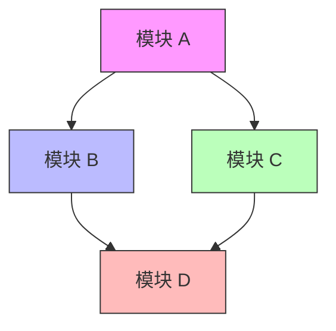
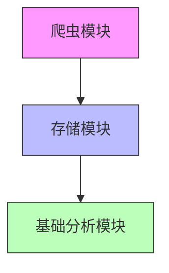

# 项目阶段实施计划模板

**用途**：用于 `/zcf:arch-doc "阶段实施计划：XXX"` 生成的标准格式

**保存位置**：`docs/architecture/plans/implementation-plan.md`

---

## 模板结构

```markdown
# {{PROJECT_NAME}} 阶段实施计划

**创建日期**：{{DATE}}
**最后更新**：{{LAST_UPDATE}}
**版本**：{{VERSION}}

---

## 概述

### 项目愿景

{{项目愿景，1-2 句话}}

### 阶段划分总览

| 阶段 | 名称 | 目标 | 预计时间 | 包含模块 |
|------|------|------|----------|----------|
| 1 | {{PHASE_1_NAME}} | {{PHASE_1_GOAL}} | {{PHASE_1_DURATION}} | {{PHASE_1_MODULES}} |
| 2 | {{PHASE_2_NAME}} | {{PHASE_2_GOAL}} | {{PHASE_2_DURATION}} | {{PHASE_2_MODULES}} |
| 3 | {{PHASE_3_NAME}} | {{PHASE_3_GOAL}} | {{PHASE_3_DURATION}} | {{PHASE_3_MODULES}} |

---

## 阶段 1：{{PHASE_1_NAME}}

### 阶段目标

{{阶段 1 的详细目标，2-3 句话}}

### 成功标准

- [ ] {{SUCCESS_CRITERIA_1}}
- [ ] {{SUCCESS_CRITERIA_2}}
- [ ] {{SUCCESS_CRITERIA_3}}

### 包含模块

{{#each MODULES}}
#### {{this.name}}

**职责**：{{this.description}}

**核心功能**：
- {{this.feature_1}}
- {{this.feature_2}}

**预计任务数**：{{this.task_count}}

**依赖模块**：{{this.dependencies}}

{{/each}}

### 模块依赖关系



### 关键任务

| 任务 ID | 任务名称 | 所属模块 | 预计工时 | 前置任务 |
|---------|----------|----------|----------|----------|
| Task 001 | {{TASK_1_NAME}} | {{MODULE}} | {{TIME}} | 无 |
| Task 002 | {{TASK_2_NAME}} | {{MODULE}} | {{TIME}} | Task 001 |
| Task 003 | {{TASK_3_NAME}} | {{MODULE}} | {{TIME}} | Task 001 |

### 建议的支撑文档

**必须创建**：
- [ ] 模块详细设计文档（每个模块）
- [ ] API 接口规范（每个模块）
- [ ] 数据库 Schema（如适用）

**推荐创建**：
- [ ] 任务计划文档（writing-plans 生成）
- [ ] 测试策略文档
- [ ] 部署文档（如适用）

### 风险与缓解

| 风险 | 影响 | 概率 | 缓解措施 |
|------|------|------|----------|
| {{RISK_1}} | {{IMPACT}} | {{PROBABILITY}} | {{MITIGATION}} |

---

## 阶段 2：{{PHASE_2_NAME}}

（结构同上）

---

## 阶段 3：{{PHASE_3_NAME}}

（结构同上）

---

## 总体里程碑

| 里程碑 | 预计日期 | 交付物 |
|--------|----------|--------|
| 阶段 1 完成 | {{DATE}} | MVP 可运行 |
| 阶段 2 完成 | {{DATE}} | 功能完整 |
| 阶段 3 完成 | {{DATE}} | 生产就绪 |
| 项目结项 | {{DATE}} | 文档完整 |

---

## 资源需求

### 人力资源

| 角色 | 人数 | 投入阶段 |
|------|------|----------|
| 后端开发 | {{N}} | 阶段 1-3 |
| 前端开发 | {{N}} | 阶段 2-3 |
| 测试工程师 | {{N}} | 阶段 1-3 |
| 架构师 | {{N}} | 阶段 1,3 |

### 技术资源

- **开发环境**：{{DESCRIPTION}}
- **测试环境**：{{DESCRIPTION}}
- **生产环境**：{{DESCRIPTION}}

---

## 变更记录

| 日期 | 变更内容 | 版本 |
|------|----------|------|
| {{DATE}} | 初始版本 | v1.0 |
| {{DATE}} | {{CHANGE}} | v1.1 |

---

## 下一步行动

**立即行动**：
1. [ ] 创建阶段 1 各模块的详细设计文档
2. [ ] 为第一个模块生成任务计划（writing-plans）
3. [ ] 同步任务到 GitHub（创建 Milestone 和 Issues）

**使用命令**：
```bash
# 创建模块详细设计
/zcf:arch-doc "阶段 1：{{MODULE_NAME}} 详细设计"

# 生成任务计划
skill_use writing-plans

# 同步到 GitHub
/zcf:github-sync "Phase 1: {{PHASE_1_NAME}}"
```
```

---

## 使用示例

### 示例：电商分析系统阶段实施计划

```markdown
# 电商分析系统 阶段实施计划

**创建日期**：2026-03-26
**最后更新**：2026-03-26
**版本**：v1.0

---

## 概述

### 项目愿景

构建一个自动化的电商商品数据分析系统，帮助商家了解市场趋势、价格波动和销量预测。

### 阶段划分总览

| 阶段 | 名称 | 目标 | 预计时间 | 包含模块 |
|------|------|------|----------|----------|
| 1 | MVP | 核心功能可运行 | 2-3 周 | 爬虫、存储、基础分析 |
| 2 | 功能扩展 | 添加高级功能 | 3-4 周 | 价格分析 Agent、销量预测、API 服务 |
| 3 | 生产就绪 | 性能优化、监控、部署 | 2-3 周 | 性能优化、监控告警、部署脚本 |

---

## 阶段 1：MVP

### 阶段目标

实现核心数据采集和基础分析功能，验证技术可行性。

### 成功标准

- [ ] 可以抓取目标电商网站商品数据
- [ ] 数据持久化到数据库
- [ ] 基础统计分析功能可用
- [ ] 单元测试覆盖率 > 80%

### 包含模块

#### 爬虫模块

**职责**：负责网页抓取、数据解析

**核心功能**：
- 基础 HTTP 请求
- HTML 解析
- URL 管理
- 异常处理

**预计任务数**：12

**依赖模块**：无

#### 存储模块

**职责**：负责数据持久化

**核心功能**：
- 数据库连接管理
- 数据模型定义
- CRUD 操作
- 数据迁移

**预计任务数**：8

**依赖模块**：无

#### 基础分析模块

**职责**：负责基础数据统计

**核心功能**：
- 价格统计
- 销量统计
- 数据导出

**预计任务数**：10

**依赖模块**：存储模块

### 模块依赖关系



### 关键任务

| 任务 ID | 任务名称 | 所属模块 | 预计工时 | 前置任务 |
|---------|----------|----------|----------|----------|
| Task 001 | 创建 Crawler 基类 | 爬虫 | 2-3h | 无 |
| Task 002 | 实现 HTML 解析器 | 爬虫 | 2-3h | Task 001 |
| Task 003 | 添加 URL 管理器 | 爬虫 | 1-2h | Task 001 |
| Task 004 | 设计数据库 Schema | 存储 | 2-3h | 无 |
| Task 005 | 实现数据模型 | 存储 | 3-4h | Task 004 |
| Task 006 | 实现价格统计 | 分析 | 2-3h | Task 005 |

### 建议的支撑文档

**必须创建**：
- [ ] 爬虫模块详细设计
- [ ] 存储模块详细设计
- [ ] 基础分析模块详细设计
- [ ] API 接口规范（所有模块）
- [ ] 数据库 Schema 设计

**推荐创建**：
- [ ] 爬虫模块任务计划
- [ ] 存储模块任务计划
- [ ] 分析模块任务计划
- [ ] 测试策略文档

### 风险与缓解

| 风险 | 影响 | 概率 | 缓解措施 |
|------|------|------|----------|
| 网站反爬 | 高 | 中 | 实现请求限流、User-Agent 轮换 |
| 数据量大 | 中 | 高 | 设计分页抓取、增量更新 |
|  Schema 变更 | 中 | 中 | 使用迁移脚本、版本控制 |

---

## 阶段 2：功能扩展

（详细设计略）

---

## 阶段 3：生产就绪

（详细设计略）

---

## 总体里程碑

| 里程碑 | 预计日期 | 交付物 |
|--------|----------|--------|
| 阶段 1 完成 | 2026-04-15 | MVP 可运行 |
| 阶段 2 完成 | 2026-05-15 | 功能完整 |
| 阶段 3 完成 | 2026-06-01 | 生产就绪 |
| 项目结项 | 2026-06-15 | 文档完整 |

---

## 下一步行动

**立即行动**：
1. [ ] 创建爬虫模块详细设计文档
2. [ ] 为爬虫模块生成任务计划
3. [ ] 同步阶段 1 任务到 GitHub

**使用命令**：
```bash
/zcf:arch-doc "阶段 1：爬虫模块详细设计"
skill_use writing-plans
/zcf:github-sync "Phase 1: MVP"
```
```

---

## 最佳实践

1. **阶段目标 SMART 原则** — 具体、可衡量、可实现、相关性、时限性
2. **模块划分** — 高内聚、低耦合，每个模块职责单一
3. **依赖关系** — 避免循环依赖，使用有向无环图
4. **风险评估** — 提前识别风险，制定缓解措施
5. **文档同步** — 阶段计划完成后，立即创建支撑文档
