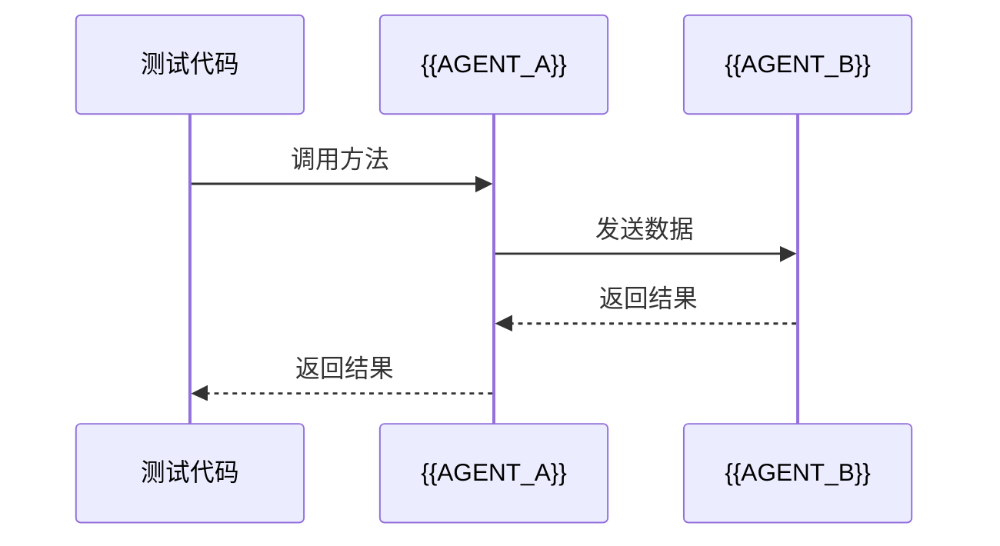
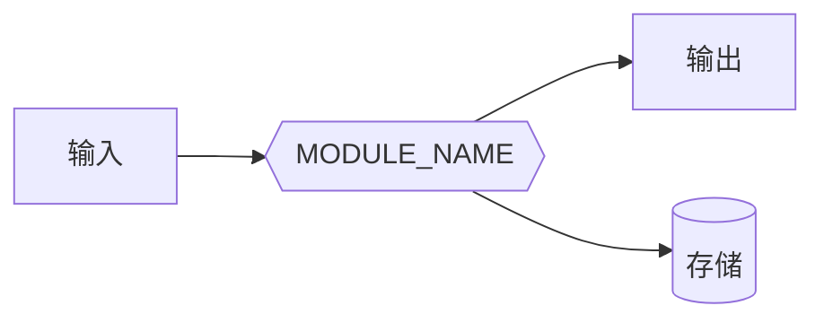

# {{MODULE_NAME}} 测试策略

**创建日期**：{{DATE}}
**最后更新**：{{LAST_UPDATE}}
**版本**：{{VERSION}}

**所属阶段**：{{PHASE_NAME}}
**所属模块**：{{MODULE_NAME}}
**测试负责人**：{{TEST_LEAD}}

---

## 1. 模块测试概述

### 1.1 模块职责

{{模块的核心职责}}

### 1.2 测试目标

{{模块测试的具体目标}}

### 1.3 测试范围

**包含内容**：
- {{SCOPE_ITEM_1}}
- {{SCOPE_ITEM_2}}

**不包含内容**：
- {{OUT_OF_SCOPE_1}}
- {{OUT_OF_SCOPE_2}}

---

## 2. 单元测试策略

### 2.1 被测单元列表

| 类/函数 | 文件位置 | 测试文件 | 优先级 |
|---------|----------|----------|--------|
| {{CLASS_1}} | {{FILE_PATH}} | {{TEST_FILE}} | {{PRIORITY}} |
| {{FUNCTION_1}} | {{FILE_PATH}} | {{TEST_FILE}} | {{PRIORITY}} |

### 2.2 测试用例设计

#### {{CLASS_NAME}} 测试

**测试场景**：
| 场景名称 | 测试方法 | 输入 | 预期输出 | 优先级 |
|----------|----------|------|----------|--------|
| 正常场景 | `test_{{method}}_success()` | {{INPUT}} | {{OUTPUT}} | P0 |
| 边界场景 | `test_{{method}}_boundary()` | {{INPUT}} | {{OUTPUT}} | P1 |
| 异常场景 | `test_{{method}}_error()` | {{INPUT}} | {{EXCEPTION}} | P0 |

**测试代码示例**：
```python
{{TEST_CODE_EXAMPLE}}
```

### 2.3 Mock 策略

**需要 Mock 的依赖**：
| 依赖 | Mock 方式 | 原因 |
|------|----------|------|
| {{DEPENDENCY_1}} | {{MOCK_METHOD}} | {{REASON}} |
| {{DEPENDENCY_2}} | {{MOCK_METHOD}} | {{REASON}} |

**Mock 示例**：
```python
{{MOCK_EXAMPLE}}
```

---

## 3. 错误处理策略

**详见**：[项目错误处理策略](../../error-handling-strategy.md)

### 3.1 模块错误分类

**模块特有错误**：
| 错误代码 | 错误名称 | 触发条件 | 处理策略 |
|----------|----------|----------|----------|
| `{{MODULE}}_INVALID_INPUT` | 无效输入错误 | 参数验证失败 | 抛出验证异常 |
| `{{MODULE}}_TIMEOUT` | 超时错误 | 操作超时 | 重试或抛出异常 |
| `{{MODULE}}_SERVICE_UNAVAILABLE` | 服务不可用 | 依赖服务失败 | 降级或抛出异常 |

---

### 3.2 单元测试中的错误测试

#### 无效输入测试

**测试场景**：
| 方法 | 无效输入 | 预期异常 |
|------|----------|----------|
| `{{method1}}` | 空值、None | `ValueError` |
| `{{method2}}` | 超范围值 | `OutOfRangeError` |

**测试代码示例**：
```python
def test_invalid_input_raises_error():
    """测试无效输入抛出异常"""
    crawler = Crawler()
    with pytest.raises(URLError):
        crawler.fetch("")
```

---

#### 超时和重试测试

**测试场景**：
| 方法 | 超时设置 | 重试次数 | 预期行为 |
|------|----------|----------|----------|
| `{{method1}}` | 1 秒 | 3 次 | 3 次重试后抛出异常 |

**测试代码示例**：
```python
async def test_timeout_with_retry():
    """测试超时触发重试"""
    crawler = Crawler(timeout=1, retry_count=3)
    mock_http.side_effect = [TimeoutError(), {"status": 200}]
    result = await crawler.fetch("https://example.com")
    assert result.status == 200
```

---

#### 资源泄漏测试

**测试场景**：
| 资源类型 | 验证点 |
|----------|--------|
| HTTP 连接 | 连接正确关闭 |
| 数据库连接 | 连接池正确释放 |

---

### 3.3 错误传播测试

**模块间错误传播**：
```python
async def test_crawler_error_not_caught_by_storage():
    """测试爬虫错误不被存储模块捕获"""
    with pytest.raises(CrawlerError):
        await crawl_and_save(crawler, storage, "invalid-url")
    storage.save.assert_not_called()
```

---

### 3.4 错误处理覆盖率

**检查清单**：
- [ ] 所有公共方法都有异常路径测试
- [ ] 所有重试逻辑都有测试
- [ ] 所有降级策略都有测试
- [ ] 所有资源泄漏都有测试

**覆盖率目标**：错误路径覆盖率 > 85%

---

## 4. Agent 协作测试策略

### 4.1 协作者列表

| 协作 Agent | 交互方式 | 接口类型 | 测试重点 |
|------------|----------|----------|----------|
| {{AGENT_1}} | {{INTERACTION}} | {{INTERFACE_TYPE}} | {{FOCUS}} |
| {{AGENT_2}} | {{INTERACTION}} | {{INTERFACE_TYPE}} | {{FOCUS}} |

### 4.2 集成测试场景

#### 场景 1：{{SCENE_NAME}}

**参与 Agent**：
- {{AGENT_A}} → {{AGENT_B}}

**测试流程**：


**测试代码**：
```python
{{INTEGRATION_TEST_CODE}}
```

---

## 5. 数据流测试策略

### 5.1 数据流图



### 5.2 数据流测试场景

| 场景 | 输入数据 | 处理逻辑 | 预期输出 | 验证点 |
|------|----------|----------|----------|--------|
| {{SCENE_1}} | {{INPUT}} | {{PROCESS}} | {{OUTPUT}} | {{VALIDATION}} |
| {{SCENE_2}} | {{INPUT}} | {{PROCESS}} | {{OUTPUT}} | {{VALIDATION}} |

---

## 6. E2E 测试策略（模块视角）

### 6.1 参与的 E2E 场景

| 场景名称 | 涉及模块 | 本模块职责 | 测试优先级 |
|----------|----------|------------|------------|
| {{E2E_SCENE_1}} | {{MODULES}} | {{RESPONSIBILITY}} | {{PRIORITY}} |
| {{E2E_SCENE_2}} | {{MODULES}} | {{RESPONSIBILITY}} | {{PRIORITY}} |

### 6.2 E2E 测试用例

#### 场景：{{E2E_SCENE_NAME}}

**前置条件**：
- {{PRECONDITION_1}}
- {{PRECONDITION_2}}

**测试步骤**：
1. {{STEP_1}}
2. {{STEP_2}}
3. {{STEP_3}}

**本模块验证点**：
- {{VALIDATION_POINT_1}}
- {{VALIDATION_POINT_2}}

**测试代码**：
```python
{{E2E_TEST_CODE}}
```

---

## 7. 测试环境

### 7.1 环境配置

| 环境 | 用途 | 配置 |
|------|------|------|
| {{ENV_1}} | {{PURPOSE}} | {{CONFIG}} |
| {{ENV_2}} | {{PURPOSE}} | {{CONFIG}} |

### 7.2 依赖服务

| 服务 | 用途 | Mock/Real |
|------|------|-----------|
| {{SERVICE_1}} | {{PURPOSE}} | {{MOCK_OR_REAL}} |
| {{SERVICE_2}} | {{PURPOSE}} | {{MOCK_OR_REAL}} |

---

## 8. 覆盖率目标

| 指标 | 目标值 | 当前值 | 测量工具 |
|------|--------|--------|----------|
| 行覆盖率 | {{TARGET}}% | {{CURRENT}}% | {{TOOL}} |
| 分支覆盖率 | {{TARGET}}% | {{CURRENT}}% | {{TOOL}} |
| 函数覆盖率 | {{TARGET}}% | {{CURRENT}}% | {{TOOL}} |

---

## 9. 测试执行

### 9.1 执行命令

```bash
# 单元测试
{{UNIT_TEST_COMMAND}}

# 集成测试
{{INTEGRATION_TEST_COMMAND}}

# 错误处理测试
{{ERROR_HANDLING_TEST_COMMAND}}
```

### 9.2 CI 集成

```yaml
{{CI_CONFIG_SNIPPET}}
```

---

## 变更记录

| 日期 | 版本 | 变更内容 |
|------|------|----------|
| {{DATE}} | v1.0 | 初始版本 |
| {{DATE}} | v1.1 | {{CHANGE}} |

---

## 相关文档

- [项目错误处理策略](../../error-handling-strategy.md)
- [模块详细设计](./detailed-design.md)
- [API 接口规范](./api-spec.md)
- [项目测试策略](../../test-strategy.md)
