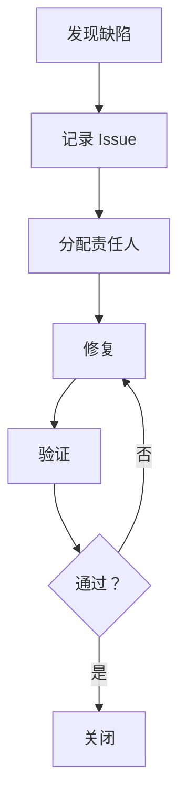

# {{PROJECT_NAME}} 测试策略

**创建日期**：{{DATE}}
**最后更新**：{{LAST_UPDATE}}
**版本**：{{VERSION}}

**所属阶段**：{{PHASE_NAME}}
**测试负责人**：{{TEST_LEAD}}

---

## 1. 测试概述

### 1.1 测试目标

{{整体测试目标，2-3 句话}}

### 1.2 测试范围

**包含内容**：
- {{SCOPE_ITEM_1}}
- {{SCOPE_ITEM_2}}

**不包含内容**：
- {{OUT_OF_SCOPE_1}}
- {{OUT_OF_SCOPE_2}}

### 1.3 测试原则

{{测试遵循的原则}}

1. **测试金字塔** — 单元测试 > 集成测试 > E2E 测试
2. **自动化优先** — 所有可自动化的测试必须自动化
3. **CI 集成** — 所有测试在 CI 中运行
4. **数据隔离** — 测试数据独立于生产数据

---

## 2. 单元测试（Unit Testing）

### 2.1 测试范围

{{单元测试覆盖的范围}}

| 模块 | 文件数 | 预期覆盖率 | 优先级 |
|------|--------|------------|--------|
| {{MODULE_1}} | {{N}} | {{X}}% | {{PRIORITY}} |
| {{MODULE_2}} | {{N}} | {{X}}% | {{PRIORITY}} |

### 2.2 测试框架

| 技术栈 | 框架 | 版本 | 用途 |
|--------|------|------|------|
| {{LANGUAGE}} | {{FRAMEWORK}} | {{VERSION}} | 单元测试 |
| {{LANGUAGE}} | {{MOCK_LIBRARY}} | {{VERSION}} | Mock 对象 |
| {{LANGUAGE}} | {{ASSERTION_LIB}} | {{VERSION}} | 断言库 |

### 2.3 测试规范

#### 命名规范

```
{{NAMING_CONVENTION}}
```

**示例**：
```python
{{TEST_NAMING_EXAMPLE}}
```

#### 测试结构

```python
{{TEST_STRUCTURE_TEMPLATE}}
```

#### AAA 模式

```python
# Arrange - 准备测试数据
{{ARRANGE_CODE}}

# Act - 执行被测方法
{{ACT_CODE}}

# Assert - 断言结果
{{ASSERT_CODE}}
```

### 2.4 Mock 策略

**Mock 使用原则**：
- {{MOCK_PRINCIPLE_1}}
- {{MOCK_PRINCIPLE_2}}

**Mock 示例**：
```python
{{MOCK_EXAMPLE}}
```

### 2.5 测试用例分类

| 类型 | 说明 | 示例 |
|------|------|------|
| **正常路径** | 验证正常输入产生预期输出 | `test_fetch_success()` |
| **边界条件** | 验证边界值处理 | `test_fetch_empty_url()` |
| **异常情况** | 验证异常抛出 | `test_fetch_timeout()` |
| **状态变化** | 验证对象状态改变 | `test_crawler_sets_user_agent()` |

### 2.6 覆盖率要求

| 指标 | 目标值 | 测量工具 |
|------|--------|----------|
| 行覆盖率 | {{LINE_COVERAGE}}% | {{TOOL}} |
| 分支覆盖率 | {{BRANCH_COVERAGE}}% | {{TOOL}} |
| 函数覆盖率 | {{FUNCTION_COVERAGE}}% | {{TOOL}} |

---

## 3. Agent 协作测试（Agent Collaboration Testing）

### 3.1 测试范围

{{Agent 间协作测试的范围}}

**测试场景**：
| 场景名称 | 涉及 Agent | 测试类型 | 优先级 |
|----------|-----------|----------|--------|
| {{SCENE_1}} | {{AGENT_A}} → {{AGENT_B}} | {{TYPE}} | {{PRIORITY}} |
| {{SCENE_2}} | {{AGENT_A}} → {{AGENT_B}} → {{AGENT_C}} | {{TYPE}} | {{PRIORITY}} |

### 3.2 测试策略

#### 策略 1：契约测试

**目的**：验证 Agent 间接口符合约定

**工具**：{{CONTRACT_TEST_TOOL}}

**示例**：
```python
{{CONTRACT_TEST_EXAMPLE}}
```

#### 策略 2：集成测试

**目的**：验证多个 Agent 协作正常

**方法**：
1. 准备测试环境
2. 启动所有被测 Agent
3. 发送测试请求
4. 验证响应链

**示例**：
```python
{{INTEGRATION_TEST_EXAMPLE}}
```

### 3.3 测试数据管理

**数据来源**：
- {{DATA_SOURCE_1}}
- {{DATA_SOURCE_2}}

**数据隔离**：
```python
{{DATA_ISOLATION_EXAMPLE}}
```

---

## 4. 端到端测试（E2E Testing）

### 4.1 测试范围

{{E2E 测试覆盖的业务流程}}

**核心业务流程**：
| 流程名称 | 涉及模块 | 预计步骤 | 优先级 |
|----------|----------|----------|--------|
| {{FLOW_1}} | {{MODULES}} | {{STEPS}} | {{PRIORITY}} |
| {{FLOW_2}} | {{MODULES}} | {{STEPS}} | {{PRIORITY}} |

### 4.2 测试工具

| 工具 | 用途 | 版本 |
|------|------|------|
| {{TOOL_1}} | {{PURPOSE}} | {{VERSION}} |
| {{TOOL_2}} | {{PURPOSE}} | {{VERSION}} |

### 4.3 测试用例设计

#### 场景 1：{{SCENE_NAME}}

**前置条件**：
- {{PRECONDITION_1}}
- {{PRECONDITION_2}}

**测试步骤**：
1. {{STEP_1}}
2. {{STEP_2}}
3. {{STEP_3}}

**预期结果**：
- {{EXPECTED_RESULT_1}}
- {{EXPECTED_RESULT_2}}

**测试代码**：
```python
{{E2E_TEST_CODE}}
```

---

## 5. 性能测试（如适用）

### 5.1 性能指标

| 指标 | 目标值 | 测量方法 |
|------|--------|----------|
| {{METRIC_1}} | {{TARGET}} | {{METHOD}} |
| {{METRIC_2}} | {{TARGET}} | {{METHOD}} |

### 5.2 负载测试

**测试场景**：
```python
{{LOAD_TEST_CODE}}
```

---

## 6. 错误处理策略

**详见**：[项目错误处理策略](./error-handling-strategy.md)

### 6.1 错误分类

遵循项目级错误处理策略的 P0-P4 分类标准。

---

### 6.2 本项目的错误处理

**本项目特有错误**：
| 错误码 | 错误名称 | 触发条件 | 处理策略 |
|--------|----------|----------|----------|
| `{{PROJECT}}_{{ERROR_1}}` | {{ERROR_NAME_1}} | {{CONDITION_1}} | {{STRATEGY_1}} |
| `{{PROJECT}}_{{ERROR_2}}` | {{ERROR_NAME_2}} | {{CONDITION_2}} | {{STRATEGY_2}} |

---

### 6.3 错误处理测试

**使用项目级框架**：
- 重试模式测试：`tests/core/test_retry.py`
- 熔断器测试：`tests/core/test_circuit_breaker.py`
- 降级模式测试：`tests/core/test_fallback.py`

**本项目特定测试**：
```python
{{PROJECT_ERROR_TEST_CODE}}
```

---

### 6.4 错误日志和监控

**日志规范**：遵循项目级日志规范

**监控指标**：
| 指标 | 说明 | 告警阈值 |
|------|------|----------|
| `{{METRIC_1}}` | {{DESCRIPTION}} | {{THRESHOLD}} |
| `{{METRIC_2}}` | {{DESCRIPTION}} | {{THRESHOLD}} |

---

### 6.5 错误处理覆盖率

**遵循项目级覆盖率目标**：
- 核心模块：> 90%
- 一般模块：> 80%
- 辅助模块：> 70%

**检查清单**：详见 [项目错误处理策略](./error-handling-strategy.md) 第 6 章

---

## 7. 持续集成

### 7.1 CI 配置

**触发条件**：
- {{TRIGGER_1}}
- {{TRIGGER_2}}

**测试阶段**：
```yaml
{{CI_CONFIG_YAML}}
```

### 7.2 测试报告

**生成工具**：{{REPORT_TOOL}}

**报告格式**：
- HTML
- JUnit XML
- Coverage JSON

---

## 8. 测试数据管理

### 8.1 测试数据分类

| 数据类型 | 来源 | 更新频率 |
|----------|------|----------|
| {{DATA_TYPE_1}} | {{SOURCE}} | {{FREQUENCY}} |
| {{DATA_TYPE_2}} | {{SOURCE}} | {{FREQUENCY}} |

### 8.2 数据脱敏

**脱敏规则**：
```python
{{DATA_MASKING_CODE}}
```

---

## 9. 缺陷管理

### 9.1 缺陷级别

| 级别 | 说明 | 响应时间 |
|------|------|----------|
| P0 | 阻塞性缺陷 | 立即 |
| P1 | 严重缺陷 | 24 小时 |
| P2 | 一般缺陷 | 3 天 |
| P3 | 轻微缺陷 | 下次迭代 |

### 9.2 缺陷流程



---

## 10. 测试覆盖率

### 10.1 当前覆盖率

| 模块 | 行覆盖率 | 分支覆盖率 | 函数覆盖率 |
|------|----------|------------|------------|
| {{MODULE_1}} | {{X}}% | {{X}}% | {{X}}% |
| {{MODULE_2}} | {{X}}% | {{X}}% | {{X}}% |

### 10.2 覆盖率趋势

```mermaid
lineChart
    title 测试覆盖率趋势
    x-axis Week1, Week2, Week3, Week4
    y-axis 0, 20, 40, 60, 80, 100
    line "行覆盖率": 60, 65, 72, 80
    line "分支覆盖率": 50, 55, 62, 70
```

---

## 变更记录

| 日期 | 版本 | 变更内容 |
|------|------|----------|
| {{DATE}} | v1.0 | 初始版本 |
| {{DATE}} | v1.1 | {{CHANGE}} |

---

## 相关文档

- [项目错误处理策略](./error-handling-strategy.md)
- [总体架构文档](./YYYY-MM-DD-{{project-name}}.md)
- [模块详细设计](./phases/phase-X/<module>/detailed-design.md)
- [API 接口规范](./phases/phase-X/<module>/api-spec.md)
