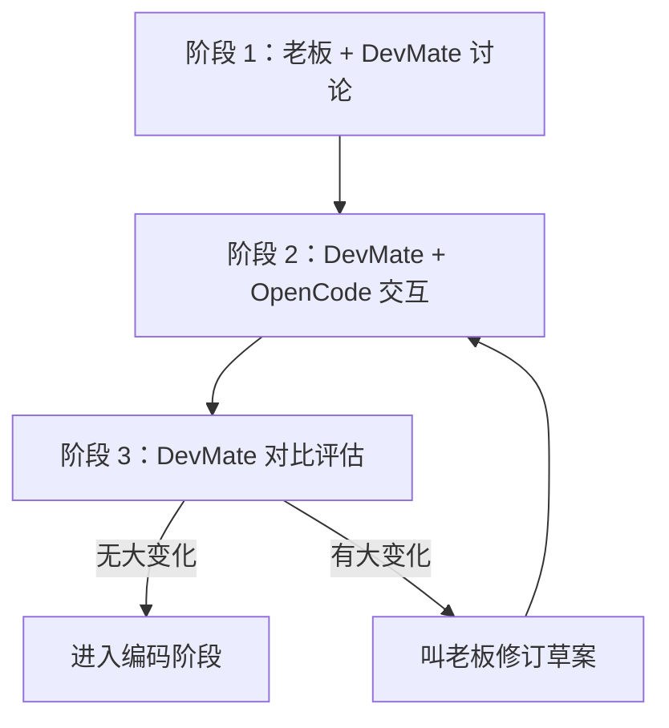

# ACF-Workflow 协作模式

> **核心理念**: DevMate 独立驱动 OpenCode，老板仅在关键决策点介入

---

## 三阶段协作流程



### 阶段 1：老板 + DevMate 讨论（提案仓库）

1. 老板提出项目目标/约束/偏好
2. DevMate 调研现有方案/技术选型
3. 双方在 `/workspace/mynotes/<项目>/proposal/` 讨论
4. 形成初步草案（DevMate 记录）

### 阶段 2：DevMate + OpenCode 交互（编码仓库）

1. DevMate 使用 `subagent + steer` 驱动 OpenCode
2. 开放思考：不限制非核心决策，让 OpenCode 充分发挥
3. 多轮对话：研究→构思→编写→评审（每轮暂停确认）
4. DevMate 记录关键决策/偏离点

### 阶段 3：DevMate 对比评估 → 决定是否叫老板

1. DevMate 对比：OpenCode 产出 vs 初步草案
2. 无大变化 → 直接进入编码阶段
3. 有大变化 → 叫老板一起修订草案
4. 修订后 → 回到阶段 2

---

## DevMate 独立驱动 OpenCode 的原则

| 维度 | 做法 | 理由 |
|------|------|------|
| **核心决策** | DevMate 和老板在阶段 1 确定 | 技术选型、架构风格、性能目标 |
| **非核心决策** | OpenCode 开放思考 | 发挥 AI 创造力，可能发现更好方案 |
| **交互方式** | subagent + steer 多轮对话 | DevMate 独立控制，无需老板介入 |
| **暂停点** | 每阶段完成后（研究/构思/编写/评审） | DevMate 确认方向，不频繁打扰老板 |
| **汇报时机** | 阶段 3 对比评估后 | 有大变化才叫老板 |

---

## 什么情况下叫老板？

### ✅ 需要叫老板（大变化）

- 架构风格与草案差异 >30%
- 技术选型变更（如 C++ → Rust）
- 性能目标无法达成，需要降级
- 发现重大风险/依赖缺失

### ❌ 不需要叫老板（小变化）

- 模块命名/目录结构调整
- 非核心算法优化
- 文档格式/组织方式调整
- 实现细节差异（不影响架构）

---

## 阶段 1 讨论记录模板

```markdown
# <项目名> 初步草案

**讨论时间**: YYYY-MM-DD
**参与者**: 老板 + DevMate

## 项目目标
[一句话描述]

## 核心约束
- 团队规模：X 人
- 周期：X 周/月
- 技术栈偏好：XXX

## 技术选型
| 维度 | 选择 | 理由 |
|------|------|------|
| 语言 | | |
| 框架 | | |
| 存储 | | |

## 架构风格
[如：三层架构、事件驱动、微服务等]

## 性能目标
- 指标 1: XXX
- 指标 2: XXX

## 开放决策（让 OpenCode 思考）
- [ ] 模块划分方式
- [ ] 具体算法选择
- [ ] 接口设计风格
```

---

## 阶段 3 对比评估模板

```markdown
# <项目名> 架构对比评估

**评估时间**: YYYY-MM-DD
**评估人**: DevMate

## 对比结果

| 维度 | 初步草案 | OpenCode 产出 | 差异 | 影响 |
|------|---------|--------------|------|------|
| 架构风格 | | | 大/中/小 | |
| 技术选型 | | | 大/中/小 | |
| 性能目标 | | | 大/中/小 | |
| 模块划分 | | | 大/中/小 | |

## 关键差异分析

### 差异 1: XXX
- **草案**: ...
- **OpenCode**: ...
- **影响**: ...
- **建议**: 接受 / 修订 / 进一步讨论

## 决策

- [ ] 无大变化，直接进入编码阶段
- [ ] 有小变化，已记录，继续推进
- [ ] 有大变化，需要叫老板修订草案

**下一步**: ...
```

---

**详细示例**: `/workspace/acf-workflow/docs/acf-subagent-driver.md`
